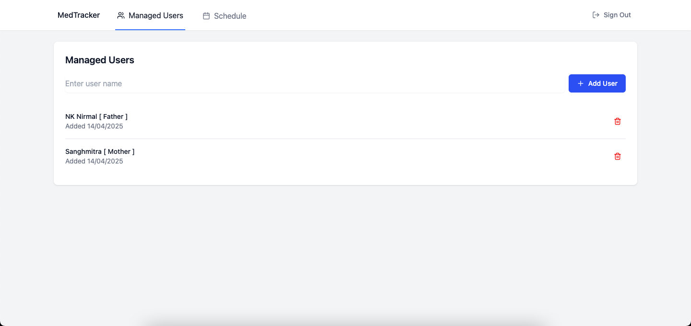
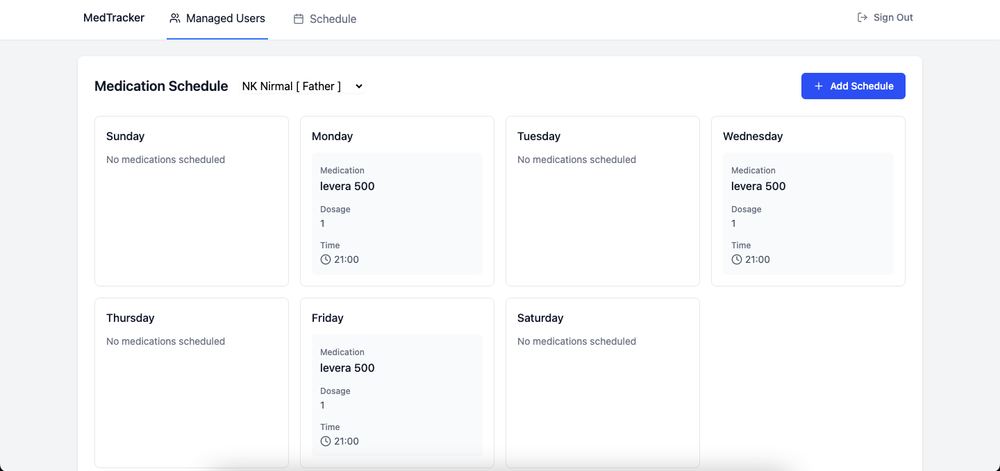

# 💊 Med Reminder

A simple, intuitive web application to help users keep track of their daily medications. Built with React, this app allows users to add, edit, and delete medicine reminders — so you'll never miss a dose again.

### 🚀 Live Demo
👉 [Try it here](https://vermillion-licorice-7d7588.netlify.app/)

---

## 🧠 Features

- ✅ Add and schedule medications
- 🕒 Set reminder times for each dose
- ✏️ Edit or delete reminders anytime
- 📱 Responsive design for mobile and desktop
- 💾 Data persists using localStorage

---

## 🛠️ Tech Stack

- ⚛️ **React** – Frontend framework
- 🎨 **CSS** – Styling
- 🧠 **JavaScript** – App logic
- 📦 **localStorage** – For storing reminders locally

---

## 📸 Screenshots

| Home | Add Reminder |
|------|--------------|
|  |  |

> _Add screenshots in a `screenshots/` folder for better visuals._

---

## 📦 Installation & Setup

```bash
# 1. Clone the repo
git clone https://github.com/priyeshgautam/med-reminder.git

# 2. Navigate into the project
cd med-reminder

# 3. Install dependencies
npm install

# 4. Run the app locally
npm start
